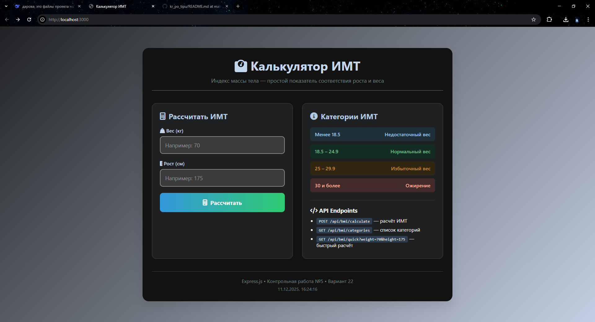
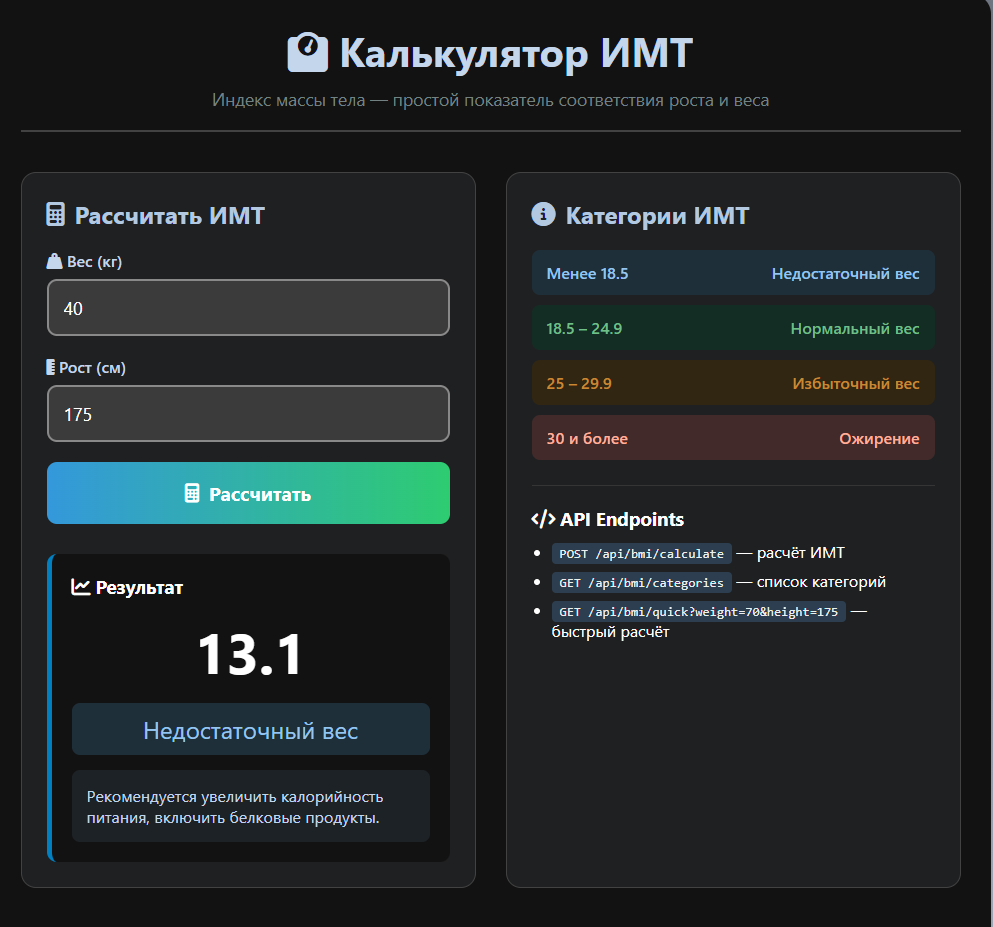
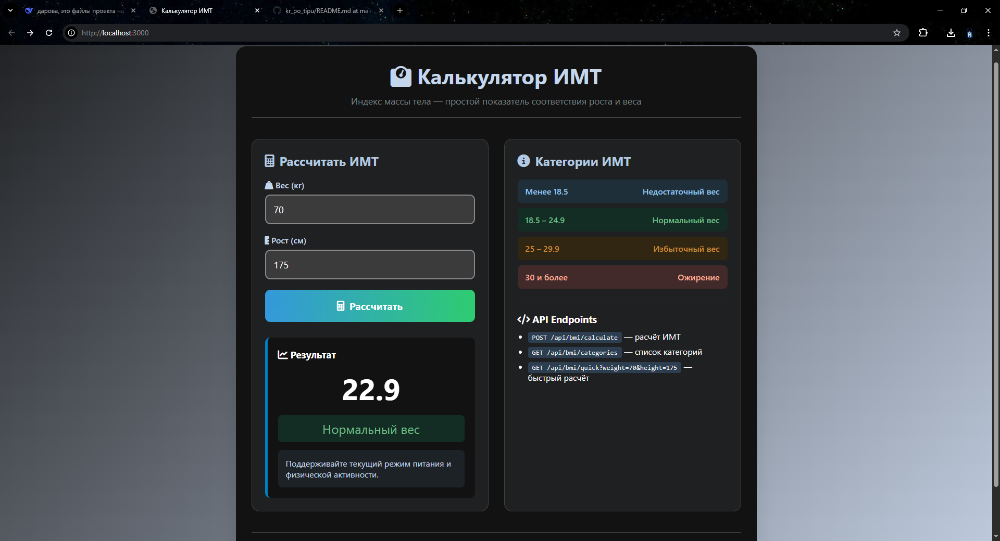
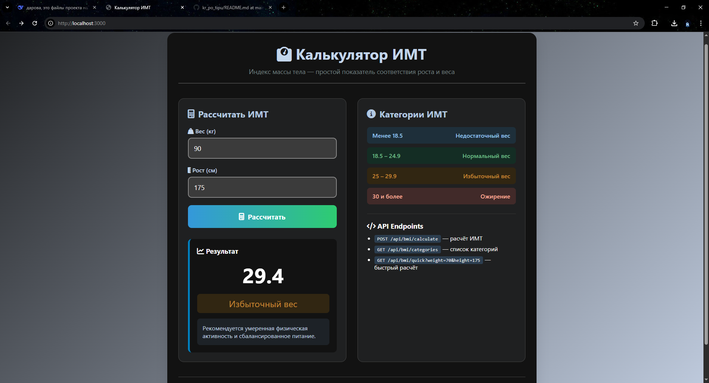

# Калькулятор индекса массы тела

## Запуск

### Быстрый запуск dev версии через cmd для разработки

```bash
npm run dev
```

## Демонстрация

---
###  Интерфейс калькулятора индекса массы тела


---

### Вывод недостаточного веса


---

### Вывод нормального веса 


---

### Вывод избыточного веса


---

### Вывод ожирения


---

## Функции
- Подсчёт индекса массы тела по формуле: вес (кг) / (рост (м)²)

---

## Технологии

- Express Js
- html
- CSS
- JavaScript

---

## Выводы по выполненной работе

- Создано полнофункциональное React-приложение с нуля
- Реализован весь требуемый функционал согласно заданию
- Приложение имеет интуитивно понятный интерфейс
- Код хорошо структурирован и легко расширяем

---